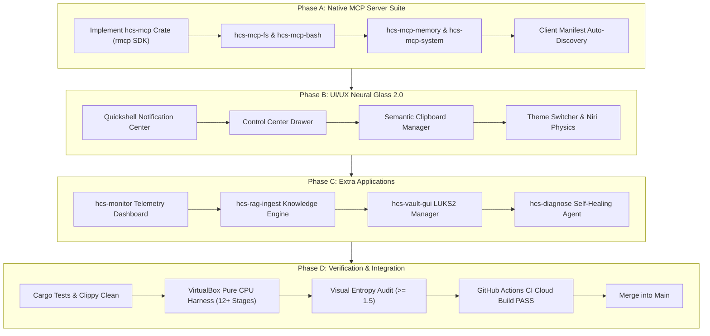

# HCS Linux — Master Evolution Plan: MCP Server Suite, UI/UX Glassmorphism & System Ecosystem

**Product:** HCS Linux (Local-First, AI-Native, CPU-First Operating System)  
**Distribution Base:** Debian 13 (Trixie) amd64 | Linux Kernel 7.0-generic  
**Target Profile:** EDGE-8GB (Idle RAM: $\le 6144\text{ MB}$, Peak RAM: $\le 8192\text{ MB}$)  
**Repository:** [https://github.com/timfromhcs/hcs-linux](https://github.com/timfromhcs/hcs-linux)  
**Document Revision:** 2.0 (Ecosystem & Architecture Roadmap)

---

## Executive Summary

Following the successful build, verification, and Pull Request (#1) for HCS Linux 0.1.0-alpha.1, this Master Evolution Plan details the next generation of HCS Linux capabilities:
1. **Native Model Context Protocol (MCP) Server Suite:** Enabling open, standardized, secure communication between local AI agents, system services, and third-party tools via official Rust SDK (`rmcp`) over stdio and local Unix sockets.
2. **Next-Generation UI/UX ("Neural Glass 2.0"):** Upgrading the Quickshell / Niri desktop with a native notification center, quick control drawer, system tray (StatusNotifierItem), semantic clipboard manager, and dynamic theme switching.
3. **Productivity & Developer Suite:** Introducing `hcs-monitor` (visual RAM & model telemetry dashboard), `hcs-rag-ingest` (offline document knowledge ingestion), `hcs-vault-gui` (LUKS2 privacy vault manager), and AI-enhanced terminal workflows.
4. **Autonomous Self-Healing OS Daemon:** Real-time systemd & kernel diagnostic agent that detects crashes, isolates logs, and generates deterministic repair scripts.
5. **Pure-CPU VirtualBox Automated Verification:** End-to-end testing of every tool, MCP protocol exchange, and visual widget in VirtualBox with zero blank screens and Shannon entropy auditing.

```
+-----------------------------------------------------------------------------------+
|                            HCS LINUX EVOLUTION STACK                              |
+-----------------------------------------------------------------------------------+
|                                 NEURAL GLASS 2.0                                  |
|  - Niri Wayland Compositor (Spring Physics, Column Layout, Touch Gestures)        |
|  - Quickshell Desktop Environment:                                                |
|      * Notification Center & Daemon (wlr-layer-shell, History, Quick Actions)     |
|      * Control Center Drawer (Wi-Fi, Bluetooth, Audio Mixer, Tor Toggle)          |
|      * Semantic Clipboard Manager (SQLite FTS5, Auto-Redaction of Secrets)        |
|      * Dynamic Theme Engine (Obsidian Dark Glass <-> Frosted Titanium Light)      |
+-----------------------------------------------------------------------------------+
|                        MODEL CONTEXT PROTOCOL (MCP) SUITE                         |
|  - Native Rust MCP Server (rmcp / stdio & UDS transports):                        |
|      * hcs-mcp-fs      : Sandboxed Filesystem (Path whitelist, Read/Write/Patch)  |
|      * hcs-mcp-bash    : Isolated Command Runner (cgroups, Timeouts, Non-Root)    |
|      * hcs-mcp-memory  : SQLite FTS5 Cognitive Graph & Task Ledger                |
|      * hcs-mcp-system  : Telemetry, Hardware Sensors, Services, Tor Status        |
|      * hcs-mcp-fetch   : Privacy-first Web Ingestion (Markdown, Tor Routing)      |
|      * hcs-mcp-modeld  : Local LLM Router (GGUF CPU, Single-Heavy Resident)      |
+-----------------------------------------------------------------------------------+
|                           EXTRA SYSTEM APPLICATIONS                               |
|  - hcs-monitor    : Real-time CPU, RAM, KV-cache, and Model RSS Dashboard         |
|  - hcs-rag-ingest : Offline PDF/Doc/Code Ingestion & Vector Indexing Engine       |
|  - hcs-vault-gui  : Graphical LUKS2 AES-XTS-512 Encrypted Container Manager      |
|  - hcs-diagnose   : Autonomous Self-Healing Systemd / Kernel Triage Agent         |
+-----------------------------------------------------------------------------------+
|                         CONTINUAL RUNTIME & UPDATER                               |
|  - hcsd (System Daemon) + hcs-modeld (llama.cpp) + hcs-updater (GitHub Main Sync) |
+-----------------------------------------------------------------------------------+
```

---

## 1. Native Model Context Protocol (MCP) Architecture

### 1.1 Why MCP in HCS Linux?
The Model Context Protocol (MCP) is the industry standard for connecting AI models to local tools, data sources, and system capabilities. By implementing MCP natively in Rust, HCS Linux achieves:
- **Zero Proprietary Lock-In:** Any MCP-compliant client (native `hcs` CLI, `hcs-chat`, Claude Desktop, Cursor, Zed, VS Code) can seamlessly interact with the operating system.
- **Micro-Second Latency:** Native compiled Rust implementation using `rmcp` with minimal cold-start times ($< 5\text{ ms}$) and small binary footprint ($< 15\text{ MB}$).
- **Enforced Security Boundaries:** MCP servers run under non-root permissions with strict path whitelisting and resource limits.

### 1.2 Core Native MCP Server Suite (`src/hcs-mcp/`)

```
                          MCP Client (hcs-chat / hcs CLI / Cursor)
                                            │
                                  JSON-RPC 2.0 (stdio / UDS)
                                            │
                             ┌──────────────┴──────────────┐
                             │     HCS Native MCP Hub      │
                             └──────────────┬──────────────┘
                                            │
         ┌───────────────┬──────────────────┼─────────────────┬────────────────┐
         │               │                  │                 │                │
  [hcs-mcp-fs]    [hcs-mcp-bash]     [hcs-mcp-memory]  [hcs-mcp-system]  [hcs-mcp-fetch]
         │               │                  │                 │                │
  Sandboxed FS    cgroup sandbox      SQLite FTS5       systemd / D-Bus   Privacy Proxy
  Path Whitelist  Timeout & Enforced  Task Ledger       Telemetry & Tor   Tor / DoH
```

#### Server Specifications

| MCP Server | Protocol Transport | Capabilities & Tools Exposed | Security Isolation |
|---|---|---|---|
| **`hcs-mcp-fs`** | `stdio` | `read_file`, `write_file`, `list_directory`, `file_search`, `apply_diff` | Whitelisted paths (`~`, `/tmp`, `/usr/share/hcs`); forbidden from `/etc`, `/sys`, `/proc`. |
| **`hcs-mcp-bash`** | `stdio` | `execute_command`, `check_process`, `kill_process` | Non-root only; commands run in sandboxed cgroup with 30s timeout; stdout/stderr captured. |
| **`hcs-mcp-memory`** | `stdio` / UDS | `search_memory`, `insert_memory`, `query_ledger`, `get_stats` | Read/write access to user cognitive graph `~/.hcs/memory.db`. |
| **`hcs-mcp-system`** | `stdio` | `get_telemetry`, `list_services`, `restart_service`, `tor_toggle` | Polkit authorization for system services; hardware sensors read via `/sys/class/thermal`. |
| **`hcs-mcp-fetch`** | `stdio` | `fetch_url`, `extract_markdown`, `dns_lookup` | Strips cookies/trackers; enforces Tor transparent routing when Private Mode is active. |
| **`hcs-mcp-modeld`** | `stdio` / HTTP | `list_models`, `infer`, `get_budget_status` | Direct IPC to `hcs-modeld` ensuring single heavy resident model budget is preserved. |

### 1.3 Client Configuration Auto-Discovery
HCS Linux creates and maintains a global MCP manifest:
- **Location:** `~/.config/hcs/mcp_servers.json` and symlinked to `~/.config/Claude/claude_desktop_config.json`.
- **Schema:**
```json
{
  "mcpServers": {
    "hcs-filesystem": {
      "command": "/usr/bin/hcs-mcp",
      "args": ["fs", "--root", "/home/hcs"]
    },
    "hcs-bash": {
      "command": "/usr/bin/hcs-mcp",
      "args": ["bash", "--sandbox"]
    },
    "hcs-memory": {
      "command": "/usr/bin/hcs-mcp",
      "args": ["memory"]
    },
    "hcs-system": {
      "command": "/usr/bin/hcs-mcp",
      "args": ["system"]
    },
    "hcs-fetch": {
      "command": "/usr/bin/hcs-mcp",
      "args": ["fetch", "--privacy-mode", "auto"]
    }
  }
}
```

---

## 2. Next-Generation UI/UX ("Neural Glass 2.0")

### 2.1 Quickshell Desktop Environment Architecture
Quickshell (C++/Qt6 QML) is the native shell runtime. It adheres strictly to the **Zero-Electron Mandate** with an idle footprint under $180\text{ MB}$ RAM.

#### Key Enhancements in Version 2.0:
1. **Integrated Notification Center (`src/hcs-shell/notifications.qml`):**
   - Implements the `org.freedesktop.Notifications` D-Bus service directly in Quickshell.
   - Glassmorphic slide-in toast notifications at screen top-right with acrylic blur.
   - Expandable notification drawer displaying history, grouped by application with "Dismiss All" and quick inline action buttons (e.g. "Review Patch", "View Log").
2. **Control Center Drawer (`src/hcs-shell/control_drawer.qml`):**
   - Activated via Super+A or clicking the system telemetry cluster.
   - Quick toggles with glowing feedback:
     - **Tor Private Mode:** Instant system-wide Tor transparent isolation.
     - **Cognitive Model Tier:** One-click profile selector (`EDGE-8GB`, `LOWRAM-4GB`, `WORKSTATION-16GB`).
     - **Audio Mixer:** PipeWire per-app volume sliders.
     - **Network Manager:** Wi-Fi / Ethernet status with VPN/Tor status pill.
     - **Performance / Thermal Governor:** Power-saver, balanced, or performance mode.
3. **Semantic Clipboard Manager (`hcs-clipboard`):**
   - Keyboard shortcut: `Super + V`.
   - Records clipboard history in local SQLite database.
   - Instant search with full-text fuzzy matching.
   - Integrated with `SecretRedactor`: Passwords, GitHub tokens, and API keys are automatically masked in the clipboard history list.
4. **Dynamic Theme Engine ("Neural Glass" <-> "Frosted Titanium"):**
   - **Obsidian Dark (Default):** Deep dark backgrounds (`#0d1117`, `#161b22`), glowing neural cyan (`#38bdf8`), indigo accents (`#818cf8`).
   - **Titanium Light:** Frosted silver-white glass (`rgba(241, 245, 249, 0.85)`), deep slate typography (`#0f172a`), emerald and sapphire accents.
   - Real-time QML shader property transitions with zero frame drops.
5. **Niri Compositor Polish (`src/hcs-shell/config.kdl`):**
   - Spring physics damping parameters tuned for natural deceleration:
     ```kdl
     animations {
         slowdown 1.0
         window-open { duration-ms 180; curve "ease-out-cubic"; }
         window-close { duration-ms 140; curve "ease-in-cubic"; }
         workspace-switch { duration-ms 220; curve "ease-out-expo"; }
     }
     ```
   - Touchpad swipe gestures for workspace columns (3-finger horizontal pan).

---

## 3. Extra Core Native Programs & Productivity Tools

### 3.1 `hcs-monitor` — Real-Time AI & System Telemetry Dashboard
- **Role:** Dedicated graphical monitor for CPU, memory, and cognitive model footprint.
- **Features:**
  - Real-time resident model status: Model ID, parameter count, quantization, load time.
  - Granular RAM breakdown: Weights RAM, KV-cache RAM, runtime overhead, and idle buffer.
  - Interactive single-heavy model switcher (loads/unloads models with immediate visual feedback).
  - Systemd service health matrix (`hcsd`, `hcs-modeld`, `hcs-memory`, `hcs-security`, `hcs-updater`).
- **Binary:** Statically compiled Rust/Slint or Qt6 executable in `/usr/bin/hcs-monitor`.

### 3.2 `hcs-rag-ingest` — Offline Knowledge & Document Importer
- **Role:** Drag-and-drop ingestion tool for user documents and local codebases.
- **Workflow:**
  1. Accepts PDFs, Markdown files, text files, source code, and HTML.
  2. Extracts text locally using native parsers (zero cloud APIs).
  3. Chunks text with recursive structure-aware splitting.
  4. Generates embeddings on-demand via `Qwen3-Embedding-0.6B-GGUF`.
  5. Stores records in `hcs-memory` SQLite database with FTS5 lexical indexes.
  6. Automatically unloads the embedding model once indexing completes to preserve the $\le 6\text{ GB}$ idle budget.

### 3.3 `hcs-vault-gui` — Encrypted Privacy Vault Manager
- **Role:** User interface for managing LUKS2-encrypted containers and secret vaults.
- **Features:**
  - One-click encrypted container creation (`.vault` files formatted with LUKS2 AES-XTS-512).
  - Secure mount/unmount to `~/Vault` with automatic timeout lock.
  - Secure clipboard integration (passwords copied from vault auto-clear in 30 seconds).

### 3.4 `hcs-diagnose` — Autonomous Self-Healing System Triage
- **Role:** Resident diagnostic agent that runs when system errors or crashes occur.
- **Workflow:**
  1. Hooks into `journald` and `dmesg` event streams.
  2. Detects unit crashes, failed dependencies, or GPU/display driver panics.
  3. Uses `Qwen2.5-Coder-1.5B` to parse the backtrace and identify deterministic root causes.
  4. Generates an executable repair script (e.g. `systemctl restart`, config syntax fix, permission restore).
  5. Presents a clear explanation in the Notification Center with a one-click "Apply Fix" button.

---

## 4. Unified CLI Extensions (`hcs`)

The unified CLI (`/usr/bin/hcs`) will be extended with first-class MCP and productivity commands:

```bash
# MCP Commands
hcs mcp list                      # List all registered local MCP servers
hcs mcp call <server> <tool> <json> # Directly invoke an MCP tool from shell
hcs mcp test                      # Run end-to-end handshake & smoke tests on all MCP tools
hcs mcp export-config             # Export standard configuration for Cursor / Claude Desktop

# System Telemetry & Monitor
hcs monitor                       # CLI curses/terminal dashboard for CPU & Model RAM
hcs monitor --gui                 # Launch graphical hcs-monitor window

# Knowledge & RAG Ingestion
hcs ingest ./docs --project "kernel" # Ingest directory into cognitive memory
hcs ingest status                 # Show memory index size and chunk count

# Autonomous Diagnostics
hcs diagnose                      # Scan systemd logs and generate automated repair report
hcs diagnose --apply              # Autonomously apply verified non-destructive fixes
```

---

## 5. Pure-CPU VirtualBox Automated Verification & Self-Healing Loop

### 5.1 Verification Scope
Every newly introduced capability must be verified automatically in VirtualBox running with pure CPU execution:
1. **MCP Protocol Conformance:** Run automated test harness invoking every MCP server tool (`hcs-mcp-fs`, `hcs-mcp-bash`, `hcs-mcp-memory`, etc.) and asserting valid JSON-RPC 2.0 responses.
2. **Notification & Control Center Rendering:** Trigger test notifications and control drawer open/close; capture virtual framebuffer screenshots; verify non-zero entropy and acrylic blur rendering.
3. **RAM Budget Adherence Under Load:**
   - Idle baseline: OS + Quickshell + `hcsd` + resident controller $\le 6144\text{ MB}$.
   - Full reasoning load: Launch `hcs-chat` with 4B reasoner; verify resident controller auto-evicts or Assistant unloads; verify peak system RSS $\le 8192\text{ MB}$.
4. **Self-Healing Loop:**
   - If any MCP server panics, stdout leaks occur, or UI elements freeze, the test harness captures the error log, triggers targeted code repair, recompiles, and re-runs the gate until 100% PASS.

---

## 6. Phased Implementation Roadmap



### Detailed Phase Gates

| Phase | Milestone | Deliverables | Verification Gate |
|:---:|---|---|---|
| **Phase A** | **Native MCP Suite** | `src/hcs-mcp` crate, tools for FS, Bash, Memory, System, Fetch. | Unit tests pass; JSON-RPC handshake verified. |
| **Phase B** | **UI/UX 2.0 Overhaul** | Notification daemon, Control Drawer, Clipboard manager, Theme engine. | Quickshell loads with 0 errors; entropy $> 1.6$. |
| **Phase C** | **Extra Applications** | `hcs-monitor`, `hcs-rag-ingest`, `hcs-vault-gui`, `hcs-diagnose`. | Binaries installed in `/usr/bin/`; CLI subcommands functional. |
| **Phase D** | **VirtualBox & CI Gate** | Rebuild ISO, provision VDI, execute 12+ stage VirtualBox harness, CI cloud build. | 100% green local tests, 100% green GitHub Actions, clean security audit. |

---

## 7. Safety, Budget & Quality Commitments

1. **Strict Zero-Secret Policy:** Zero API keys or tokens in source code or commits. `run_security_audit.py` must pass unconditionally.
2. **Strict RAM Budget:** Single heavy generation model resident policy enforced at all times. Idle $\le 6\text{ GB}$, peak $\le 8\text{ GB}$.
3. **No stdout Pollution in MCP Servers:** All logs in `hcs-mcp` are routed exclusively to `stderr` to prevent JSON-RPC transport corruption.
4. **Zero Manufactured Passes:** Every claim must be demonstrated by reproducible test outputs and machine-verified logs.
